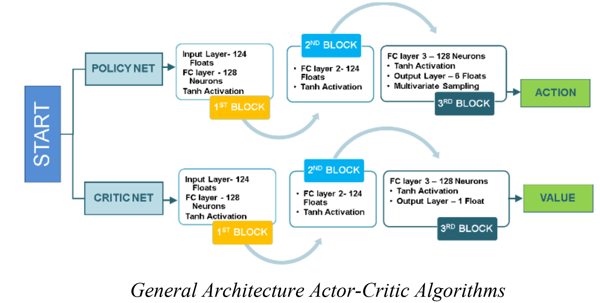
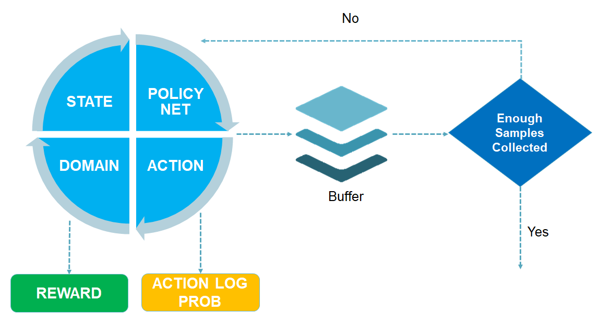
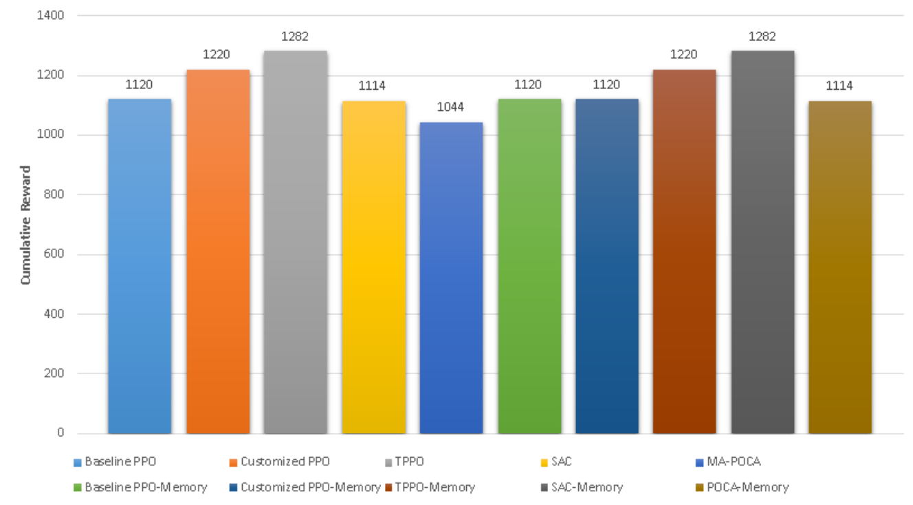

# Autonomous Drone Swarm Navigation in Complex Environments
## Abstract
Swarm intelligence is the behavior exhibited by a group of organisms performing simple actions in unison which leads to complex global behavior. This learnt behavior promotes formation of artificial swarm systems for accomplishing complex tasks and in this paper, the behavior learnt by a swarm of drones is used to accomplish multiple tasks related to complex environment navigation, obstacle avoidance and single-target tracking. In the past, manual formulation of artificial swarm systems has been attempted. The swarms usually have to be flexible entities that need to adapt to changing environments but manually crafted swarms can’t adapt to newer operating conditions thus they are not feasible. To tackle these challenges, an autonomous drone swarm navigation (ADSN) system is presented by introducing a customized architecture based on Truly Proximal Policy Optimization (TPPO) with the addition of memory cells. Furthermore, suitable 3D environments are designed for conductive learning with the addition of stability factors for drones to mimic real-life environments. Measures like Mean Cumulative Reward (MCR), Value Loss (VL), and Entropy are used to measure the performance of the presented ADSN system and other models with and without LSTM and found that incorporating memory does enhance the performance of the models although in some cases increase might not be that significant. TPPO with memory seems to have least loss and almost always performs best. Significant improvements were achieved compared to existing methodologies in convergence speed and enhanced stability of the model by customizing the architecture and hyper- parameter optimization. It is observed that Soft Actor Critic (SAC) is highly dependent on the values of the hyper-parameters and its results vary greatly with different values of hyper-parameters. The presented model has applications in maze navigation, target tracking, hover drones and other real-time scenarios.

<div align="center">
  
</div>

## Data Collection

Collection of data before every step (action).
<div align="center">
  
</div>

## Demonstraitons
Check out demos [here](https://www.youtube.com/playlist?list=PLq0872kWvR0U9KGei4EfobS_i3K-Bh6ve)
## Installation

Packages required to run:
```shell
python
cudatoolkit
pytorch
torchvision
Unity3D 
mlagents
tensorFlow


```
## Results
<div align="center">
     
</div>


NOTE: Source code will be added soon.
## Citation

```
@INPROCEEDINGS{9990563,
  author={Qamar, Suleman and Qamar, Maryam and Shahbaz, Muhammad and Arif Arshad, Muhammad and Saher Shah, Najmus and Khan, Asifullah},
  booktitle={2022 19th International Bhurban Conference on Applied Sciences and Technology (IBCAST)}, 
  title={Autonomous Drone Swarm Navigation in Complex Environments}, 
  year={2022},
  volume={},
  number={},
  pages={290-295},
  doi={10.1109/IBCAST54850.2022.9990563}}

```
